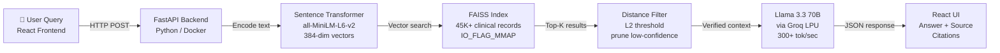

## 📸 Preview

| | |
|---|---|
| .png) | .png) |
| .png) | .png) |


# 🦉 Dr. Owl: AI Medical RAG Assistant

Dr. Owl is a production-grade **Retrieval-Augmented Generation (RAG)** system designed to bridge the gap between static medical datasets and real-time AI reasoning. By grounding a 70B parameter LLM in a verified medical database, Dr. Owl provides fast, accurate, and citable medical insights.

## 🚀 Live Demo
* **Frontend (User Interface):** https://dr-owl-medical-rag.vercel.app/

---

## 🏗️ Architecture Overview
Unlike standard chatbots that rely solely on internal training data, Dr. Owl uses a **decoupled architecture** to ensure reliability and speed:

* **The Brain:** Powered by the **Groq LPU™ Inference Engine** running `Llama-3.3-70b-versatile`. This setup achieves near-instant response times for high-complexity medical reasoning.
* **The Memory:** A local **FAISS (Facebook AI Similarity Search)** index containing over **45,000 medical records**.
* **The Infrastructure:** * **Backend:** Containerized **FastAPI** (Python) server deployed via **Docker** on Hugging Face Spaces.
    * **Frontend:** Responsive **React.js** application hosted on **Vercel**.

---
## 🔄 How It Works


---

## 📂 Dataset & Data Processing
The intelligence of Dr. Owl is anchored in a recognized clinical dataset:

* **Source:** [Comprehensive Medical Q&A Dataset] (https://www.kaggle.com/datasets/thedevastator/comprehensive-medical-q-a-dataset)
* **Size:** 45,000+ unique clinical records.
* **Processing:**
    * **Cleaning:** Data was pre-processed to remove noise and normalize clinical terminology.
    * **Embedding:** Utilized the `all-MiniLM-L6-v2` Sentence-Transformer to convert clinical text into 384-dimensional dense vectors.
    * **Indexing:** Built using **FAISS** for optimized L2-distance similarity searches, allowing for millisecond retrieval across the entire dataset.

---

## 🎯 Key Features & Technical Highlights

### 🔍 Semantic Search & Transparency
* **Vector Retrieval:** Instead of simple keyword matching, Dr. Owl understands the *context* behind medical queries using high-dimensional embeddings.
* **Relevance Scoring:** Every retrieved record is mathematically analyzed and assigned a status (**High, Medium, or Low relevance**) based on its Euclidean distance from the query.
* **Source Verification:** The UI displays the **exact context snippet** from the Kaggle dataset, allowing users to verify the specific record the AI used as a reference.

### ⚙️ Engineering Optimizations
* **Memory Management:** Implemented `faiss.IO_FLAG_MMAP` to allow the large vector index to be mapped from disk, ensuring the app remains stable within cloud-constrained RAM environments.
* **Hardware Acceleration:** Integrated **Groq’s LPU hardware** to eliminate the latency typically associated with large-scale 70B parameter models.
* **DevOps:** Fully containerized with **Docker**, ensuring seamless deployment and environment consistency.

---

## 🛠️ Tech Stack
* **Frontend:** React.js, CSS3, JavaScript
* **Backend:** FastAPI (Python), Uvicorn
* **AI/ML:** FAISS, Sentence-Transformers, Groq Cloud SDK
* **Cloud:** Hugging Face Spaces (Docker), Vercel

---

## 💻 Local Setup
1.  **Clone the Repo:**
    ```bash
    git clone https://github.com/ApekshaDave/Dr-Owl-Medical-RAG.git
    ```
2.  **Backend Setup:**
    ```bash
    cd backend
    pip install -r requirements.txt
    python api.py
    ```
3.  **Frontend Setup:**
    ```bash
    cd frontend
    npm install
    npm start
    ```

---

## ⚠️ Medical Disclaimer
Dr. Owl is an AI-powered research tool intended for **educational and demonstration purposes only**. It is not a substitute for professional medical advice, diagnosis, or treatment. Always seek the advice of a qualified healthcare provider with any questions regarding a medical condition.

## 📄 License
Distributed under the **MIT License**. See `LICENSE` for more information.
